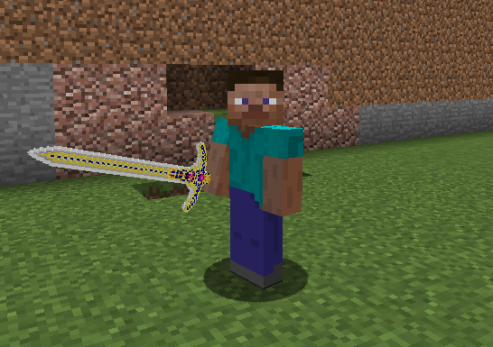

# 添加物品模型

### 什么是物品模型

阿勒，不懂吗，就原版可以添加的3d武器材质包那样的

### 模型、贴图文件放置位置
**模型** 和 **材质** 均需要放置在DragonCore/models/items/《path》/文件夹内

《path》指你插件配置里的path,如本示例配置为 **模型1**

也就是  **DragonCore/models/items/模型1/**  内

#### 注意事项:
-   模型文件必须命名为 model.json
-   模型内的textures均必须改为 **core:贴图文件名**
-   可参考群内材质包内的物品模型（如下为 **模型1** 的json）

    {
    	"credit": "Made with Blockbench",
    	"texture_size": [200, 200],
    	"textures": {
    		"1": "core:1", <- 看这，core:1  1是贴图文件的名称
    		"6": "core:2", <- 同理
    		"7": "core:3",
    		"8": "core:4",
    		"9": "core:5",
    		"particle": "core:7"
    	},
    	"elements": [
    	}
    }

------------

### 插件配置
配置文件：ItemIcon.yml

    测试模型1:
      # 匹配文本，支持 物品名，Lore，NBT任意一个
      match: "测试模型1"
      # 贴图材质均需要放置在DragonCore/models/items/<path>/文件夹内
      path: "模型1"
      # 缩放倍数(不推荐缩放)
      scale: 2
	  
### 一切大功告成，让我们为物品添加lore:测试模型1 测试效果吧

------------

### 重载资源文件
在游戏内同时按下O和P，即可重新读取模型和贴图数据