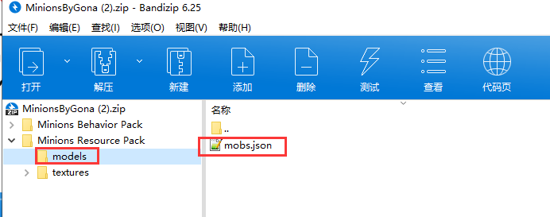
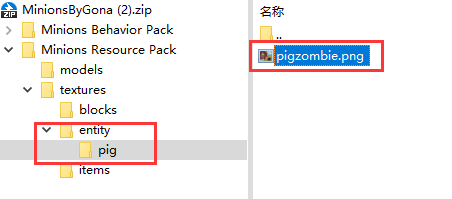

# 添加实体模型

### 添加一个简单的模型

#### 第一步--下载Blockbench
由于网上大多数基岩版模型，都是旧版本的模型，因此
建议先下载一个Blockbench软件，用于转换模型为新版本模型
#####下载途径
- 官网: https://blockbench.net/downloads/
- QQ交流群内：901704037

------------

#### 第二步--下载模型
我们先找一个模型进行下载，比如这里提供了MCBBS版主发布的小黄人模型
https://www.mcbbs.net/forum.php?mod=viewthread&tid=658704

将里面的模型文件 和 贴图文件解压出来
放到  **DragonCore/model/entities/小黄人/**  里面

------------

#### 第三步--检查模型

1.看一下json内顶行是不是有`"format_version": "1.12.0"` 的字样

2-1.如果没有或者它不是1.12.0，那我们就打开Blockbench，用它打开该json文件

3.点击左上角的`文件`按钮，再点击它的`转换工程`按钮，选择`基岩版模型`

4.确定后，再次点击`文件`，选择`导出`->`导出基岩版几何体`

5.该模型已经转为新版基岩版模型了，覆盖删除掉原来的json即可

------------

2-2.如果json内顶行有 `"format_version": "1.12.0"` 的字样

3.继续检查json是否存在`north` `south` 字样

4.如果不存在，则模型可以正常使用

5.如果存在，则需要像上面一样，用Blockbench载入模型，`转换`为`旧版基岩版模型`，再`转换`回`基岩版模型`

------------

#### 第四步--填写配置文件

打开插件配置里的EntityModel.yml

    # 该名称随意
    小黄人:
      # 识别生物的名字
      entity: "小黄人"
      # 你的文件路径
      model: "小黄人/mobs.json"
      texture: "小黄人/pigzombie.png"
      # 碰撞箱大小
      height: 1
      width: 1

#### 第五步--测试效果
现在你只需要随便生成一头生物，且名字为`小黄人`，它就会显示为该模型了

