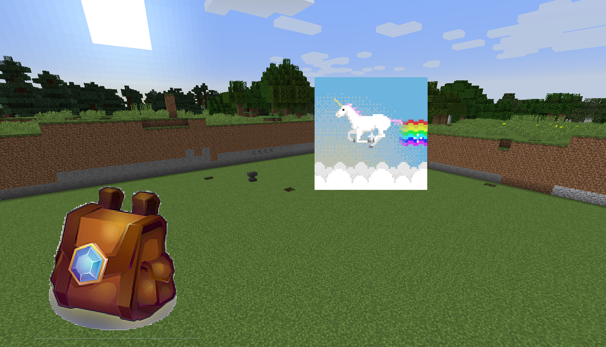

# 添加世界贴图

### 什么是世界贴图

类似于HD全息文字那样，在世界里显示文字一样，但我们这个是显示一幅图片

### 使用介绍
只需要一句简单的指令，即可显示图片

**/core WorldTexture_create <节点名> <贴图路径> <宽> <高> <是否跟随玩家视角(true/false)>**

- 节点名任意，但是不要与其他名称重复
- 贴图路径是从DragonCore开始的路径
- 支持GIF图片
- 支持图床链接
