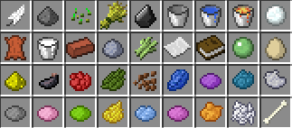
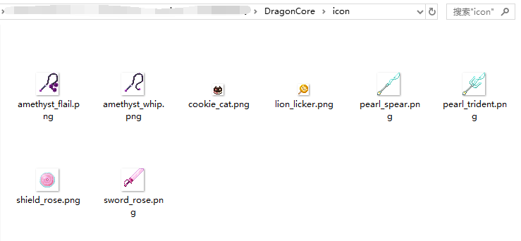
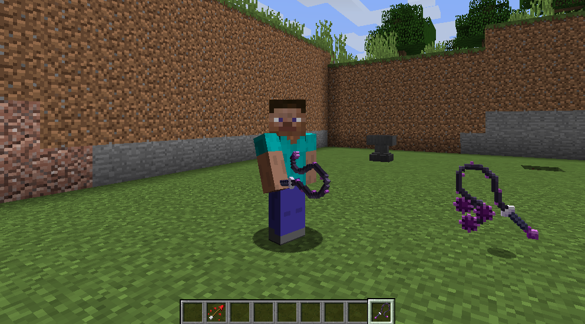

# 添加物品图标

### 什么是物品图标
物品图标指没有呈现出3D模型的物品的贴图
也就是原版的 钻石剑,染料 等物品

------------

### 图标文件放置位置
所有物品图标，均放置在DragonCore内的icon文件夹内

------------

### 插件配置
配置文件：ItemIcon.yml

    贴图1:
      # 匹配文本，支持 物品名，物品Lore，NBT 任意一个
      match: "测试材质1"
      # 材质文件名（可使用GIF），也可直接写图床链接
      # 如texture: "https://ftp.bmp.ovh/imgs/2020/10/0ca95f607c10f6bb.png"
      # 请注意：贴图必须保证宽高相等，否则会显示错误
      texture: "amethyst_flail.png"
      # 缩放大小
      scale: 2
      # 手持物品时，物品将处于屏幕正中间
      center: true
	  
### 一切大功告成，让我们为物品添加lore:测试材质1 测试效果吧
	  

------------

### 重载资源文件
在游戏内同时按下O和P，即可重新读取模型和贴图数据
