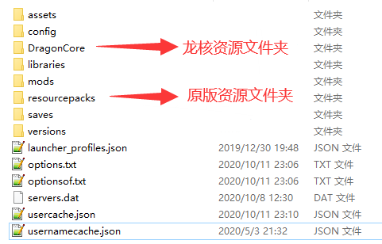
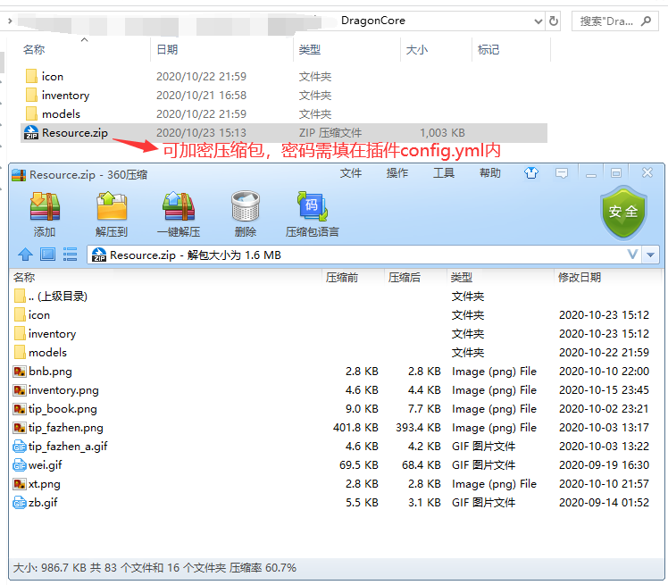

# 资源文件

### 原版的资源文件位置

原版的资源文件，均放置在客户端resourcepacks文件夹内

------------

### 龙核的资源文件位置
龙核的资源文件，放置在客户端DragonCore文件夹内
且该文件夹与resourcepacks同级

------------

### 加密资源压缩包
压缩包内文件的路径，与DragonCore文件夹内文件路径一致
压缩包只能命名为Resource.zip，并放置在DragonCore的第一层目录下

------------

### 重载资源文件
在游戏内同时按下O和P，即可重新读取模型和贴图数据
